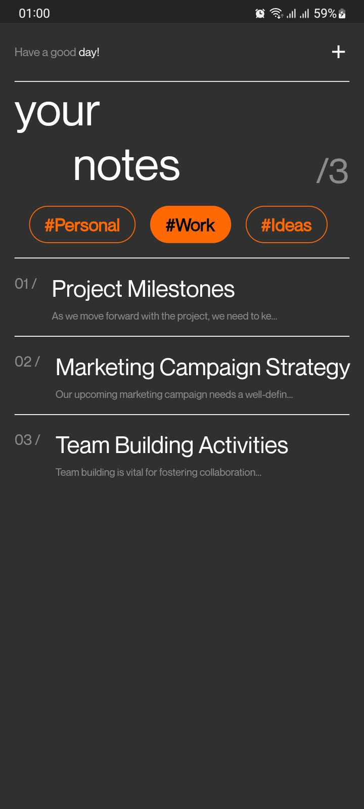
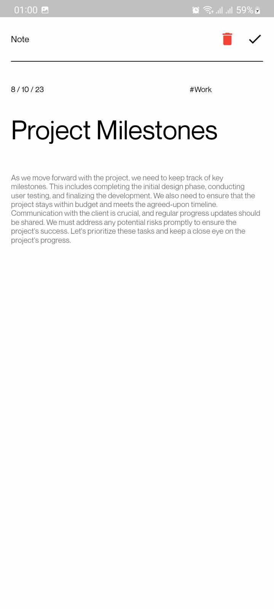

# Flutter Notes App
| Single page   | All notes     |
|---------------|---------------|
|| |


Flutter Notes App is a simple note-taking application built with Flutter, offering basic CRUD (Create, Read, Update, Delete) functionality for your notes, along with the ability to tag your notes for better organization. It also includes smooth animations for a delightful user experience.

## Features

- Create, read, update, and delete notes.
- Categorize your notes using tags.
- Smooth animations for a visually appealing experience.

## Installation

1. Make sure you have Flutter installed. If not, you can follow the [Flutter installation guide](https://flutter.dev/docs/get-started/install).

2. Clone this repository:

    ``` bash
    git clone https://github.com/your-username/flutter-notes-app.git
    ```

3. Navigate to the project directory:
    ```
    cd flutter-notes-app
    ```

4. Run the app:
    ```
    flutter run
    ```

## Usage
- Open the app, and you'll land on the home screen, where you can view your existing notes.
- To create a new note, tap the action button (plus icon).
- To edit a note, simply tap on it in the list, make your changes, and save.
- To delete a note, firstly open a note to edit and then tap on the delete action button on the top right.
- You can add tags to your notes when creating or editing them, allowing for better categorization.
- To view notes with a specific tag, use the tag filter feature.